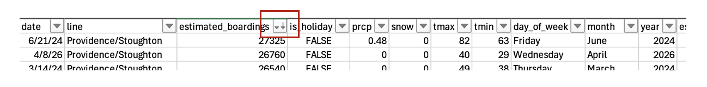
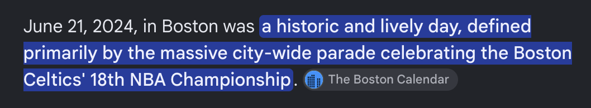
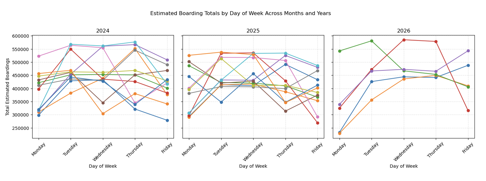
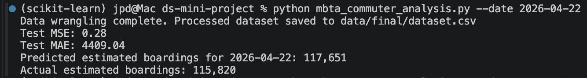
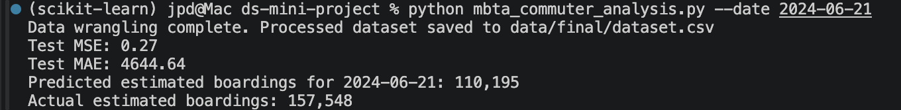
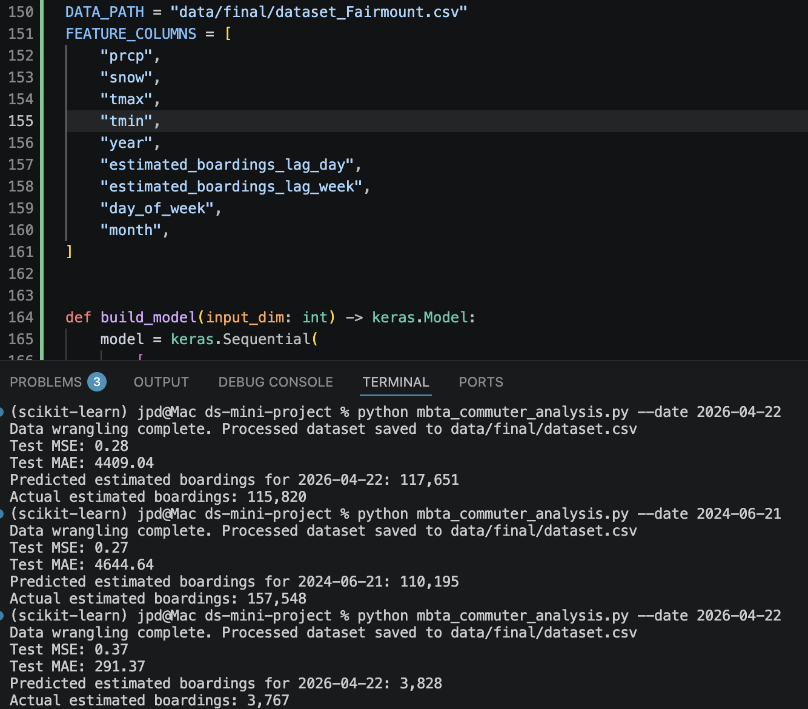

# MBTA Commuter Analysis

## Objective

Can we estimate MBTA commuter rail ridership for a certain day, considering holidays and weather?

## Data Set

The main data set used is MBTA commuter rail estimated boardings data from 2020 to present (May 2026). The data set contains one row per line per day. There are 12 commuter rail lines and the data set includes weekends and holidays. The estimated boardings field is based on counts by conductors, and the set contains 24,627 observations.

The MBTA data set is augmented with local weather and holiday data. I retrieved weather data from the National Centers for Environmental Information – originally selecting data from Norwood, MA but I decided to stick to data from Boston Logan International Airport because there was an explicit snow variable. I had originally selected Norwood because it covers the weather for a large swath of the suburbs, including the busiest line (Providence/Stoughton).

Not all commuters in Boston work white-collar office jobs, but considering the majority of weekday commuters do, I tried to collect the main holidays for which commuters will be either not working or working from home (if possible). Thus, holiday data was collected for federal holidays, New York Stock Exchange (trading) holidays, and the very Boston-centric Patriot’s Day (Marathon Monday).

I opted in the data wrangling step to group by date and sum all lines per day. Analyzing the data per line makes sense, but for this project, and for ease of use, I decided to combine all into one “estimated boardings” value per day. What would ultimately work better, though, are data that show the estimated boardings per line per station, and at certain time periods per day. We could focus the analysis on certain main stations in the city, and filter out time periods outside of the typical nine-to-five workday (excluding events like concerts and sports in the evening, for example).

### Sources

MBTA data
- https://mbta-massdot.opendata.arcgis.com/datasets/59b5c61e8e9f42f9a3745f7ad63d07d6/explore

Boston weather data
- https://www.ncei.noaa.gov/cdo-web/datasets/GHCND/stations/GHCND:USW00014739/detail

US federal, NYSE, and Patriot's day holiday data
- Federal:
  - https://www.opm.gov/policy-data-oversight/pay-leave/federal-holidays/#url=2024
- Trading:
  - https://ir.theice.com/press/news-details/2023/NYSE-Group-Announces-2024-2025-and-2026-Holiday-and-Early-Closings-Calendar/default.aspx
- Patriot's day:
  - https://www.timeanddate.com/holidays/us/patriots-day

## Data Wrangling

For data wrangling, I decided to filter the MBTA data set to include only data from years 2024, 2025, and current (2026). Due to the COVID-19 lockdown and subsequent return to regular commuter life, I thought the data pre-2024 would be slightly skewed – not representative of the current commuting landscape. The raw holiday data were merged into one file, and the weather data were filtered to include only observations from Boston Logan. I included only the weather variables I thought mattered to commuters: rain, snow, and temperature.

After merging all the data into one final data set, I created the following features: day of the week, the month, the year, boardings for the prior day, and boardings for the same day a week prior.

I explored the data initially in Excel, mainly for filtering on certain fields like line and day of the week, and also for getting the min and max estimated boardings. For example, I found an outlier in terms of commuter data: Friday, June 21st, 2024 was the busiest day in the set.



This is explained by the news of that day – the Boston Celtics’ NBA championship parade.


 
I also explored the data a little with the help of Github Copilot in a Jupyter notebook. Below is a screenshot of a plot looking at the estimated boarding totals per day of the week and month/year. The colors represent different months. I would need to look at this data a little closer, but one observation is, across months, at least in 2024 and 2025, there is a clear preference for Tuesday – Thursday in terms of commuter rail boarding totals.



## Model

I decided to keep the data wrangling code in with the model code. This is due mainly to the fact that I had already submitted this work under the main `mbta_commuter_analysis.py` file, and originally had only the data wrangling piece completed. For keeping the diff history consistent to show the new model code, I kept everything in one file.

I wanted to be able to see a prediction of estimated boardings for a certain date, so there is an argument to the script now, namely, `--date`.

All ML model code was generated via Github Copilot model MAI-Code-1-Flash.

To run the code checking against a certain date, include a date in YYYY-MM-DD format:

```
python mbta_commuter_analysis.py --date 2026-04-22
```

## Results

After a few iterations of prompting and testing results, I found that the model is pretty accurate at predicting estimated boardings for a certain day. The mean squared error (MSE) consistently sits close to zero (around 0.27) and the mean absolute error (MAE) is about 3 to 7 percent of the estimated total for the day.



Not surprisingly, passing the outlier day of June 21st, 2024 fails to predict the one-off Friday event that caused a major increase in commuter rail ridership that day.



In an earlier iteration of data wrangling I had created a loop in the python script to iterate through the data set and create a final set per line. As my "final" subfolder still contained the files, I used some of the "line" files to test the results as well. The "line" data sets can help to more accurately predict the estimated boardings, as some of them might contain more "scheduled" ridership (not used for events like certain games or concerts).



This project was created over a week for a class on software tools for AI/ML. Future enhancements to the project would include:
- adding the ability to pass future dates to the model with corresponding feature fields like weather to test the prediction model on a date outside of the training set.
- augmenting the MBTA data set with data on boardings per line, per station and time of day.
- adding other data sets, e.g., traffic data, to better predict the true ebb and flow of daily commuters to the city.
